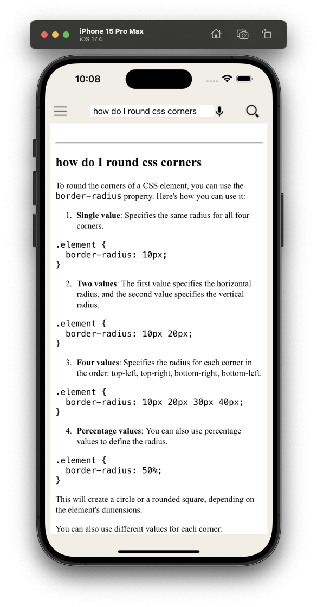
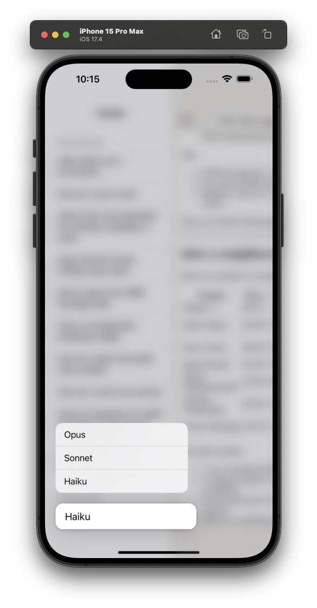
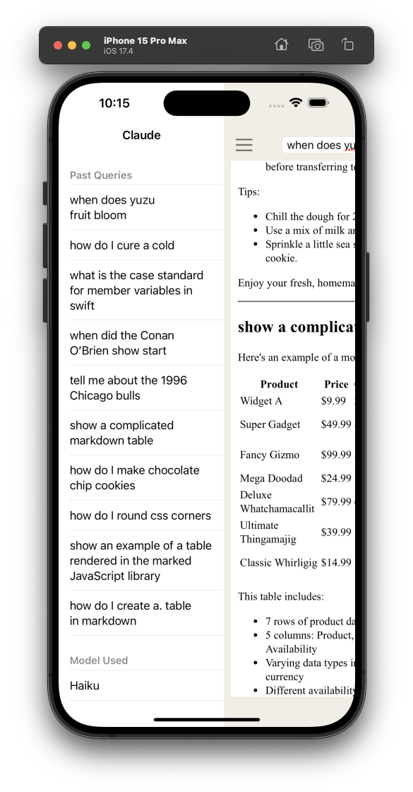

# Anthropic Mobile App

This is an unofficial version of an Anthropic Claude client while we wait for the official one to come out.

# Installation
1. pod install 
2. Open claude.xcworkspace
3. Edit Config.plist and add your API key to the ANTHROPIC_API_KEY row

# Features
1. Speech to text
2. Change between Opus, Sonnet and Haiku (open the sidebar nav [hamburger menu]) and long press the Model at the bottom
3. Renders markdown
4. Respects night mode 

